# Home Credit HE Credit-Scoring Workload

## Goal

The primary product workload is now `home_credit_risk_scoring`. The separate
EDA jobs remain supporting checks, grouped into four understandable reports.

The HE server never receives raw Home Credit CSV files, `SK_ID_CURR`, plaintext
feature values, the secret key, or decrypted scores.

## Notebook Feature Coverage

| Feature family | Notebook source | Client-created applicant features |
| --- | --- | --- |
| Application | Complete EDA and gentle introduction | Amounts, external scores, age/employment, family, region, ownership and selected category flags |
| Domain ratios | Gentle introduction | Credit/income, annuity/income, credit term, goods/credit, employment/age and children/family |
| Bureau | Manual feature engineering part 1 | Loan counts, active/closed counts, credit/debt/overdue totals and recency |
| Bureau balance | Manual feature engineering part 1 | History length, latest/oldest month and delinquency counts |
| Previous application | Complete EDA and manual feature engineering part 2 | Application counts, approval/refusal, amounts, terms and decision recency |
| POS cash | Manual feature engineering part 2 | Contract history, remaining installments and DPD behavior |
| Credit card | Manual feature engineering part 2 | Balance, limit, utilization, drawings, payments, receivables and DPD |
| Installments | Manual feature engineering part 2 | Payment totals, underpayment, payment ratio and late-payment behavior |

This covers every notebook data family without blindly encrypting the hundreds
or thousands of correlated columns produced by generic `count/mean/min/max/sum`
expansion. The trainer selects a bounded model feature set, 48 by default.

## Trust And Compute Flow

```mermaid
flowchart LR
    raw["Trusted client<br/>8 Home Credit tables"]
    fe["Applicant feature builder<br/>joins + aggregates by SK_ID_CURR"]
    train["Trusted model training<br/>logistic regression + top-K selection"]
    prep["Scale + align rows<br/>private applicant row map"]
    enc["OpenFHE CKKS encryption<br/>feature vectors"]
    queue["Web + Redis/RQ"]
    score["C++ HE server<br/>weighted encrypted sum + bias"]
    result["Encrypted logits"]
    client["Trusted client<br/>decrypt + sigmoid + risk band"]

    raw --> fe --> train --> prep --> enc --> queue --> score --> result --> client
```



The server computes:

```text
encrypted_logit = bias + sum(encrypted_scaled_feature_i * plaintext_weight_i)
```

The trusted client restores `SK_ID_CURR`, applies sigmoid, and reports:

```text
SK_ID_CURR, logit, default_probability, risk_band
```

## Grouped Supporting EDA

| Workload | Purpose |
| --- | --- |
| `eda_application_overview` | Missingness, target balance, application categories and numeric bins |
| `eda_default_segments` | Default count by customer segment |
| `eda_previous_history` | Previous-application distributions and target-conditioned history |
| `eda_correlation` | Selected encrypted sufficient statistics for Pearson correlation |

The old fine-grained EDA workload names remain accepted for compatibility but
are hidden from the main server web selector.

## Client Pipeline

```bash
python3 code/client/home_credit/build_home_credit_scoring_features.py \
  --data-dir data/home_credit \
  --output prepared_payloads/home_credit_scoring/features.csv \
  --require-all-tables

python3 code/client/home_credit/train_home_credit_scoring_model.py \
  --features prepared_payloads/home_credit_scoring/features.csv \
  --output models/home_credit_scoring_model.json \
  --max-features 48

python3 code/client/home_credit/prepare_home_credit_scoring.py \
  --features prepared_payloads/home_credit_scoring/features.csv \
  --model models/home_credit_scoring_model.json \
  --output-dir prepared_payloads/home_credit_scoring/he

./build/encrypt_home_credit_payload \
  --prepared-dir prepared_payloads/home_credit_scoring/he \
  --server-output-dir encrypted_payloads/home_credit_scoring \
  --client-key-dir keys/home_credit_scoring \
  --slots 4096

python3 code/client/home_credit/package_home_credit_upload_bag.py \
  --encrypted-dir encrypted_payloads/home_credit_scoring \
  --workload credit_risk_scoring \
  --output-dir client_runs/home_credit_scoring/server_uploads \
  --client-key-dir keys/home_credit_scoring \
  --secret-output-dir client_runs/home_credit_scoring/client_private
```

Upload:

```text
client_runs/home_credit_scoring/server_uploads/home_credit_risk_scoring.upload.zip
```

The private directory retains the secret key, crypto context, scoring row map,
and model metadata required to turn decrypted slots into applicant results.

## Important Boundary

Feature joins and aggregation currently occur at the trusted client because
OpenFHE does not provide a general encrypted relational join. PSI remains an
optional protected cross-party matching experiment. After applicant features
are aligned, scoring itself runs on ciphertext at the HE server.
