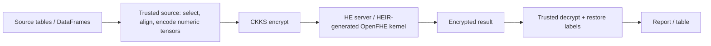
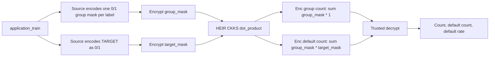
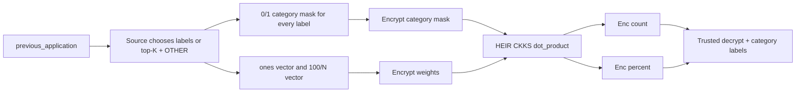
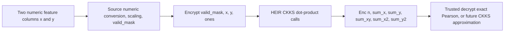
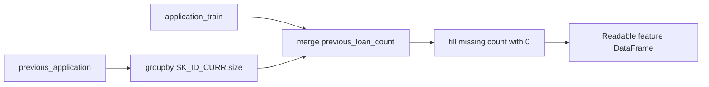
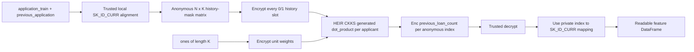

# Home Credit HEIR Benchmark Diagrams

This document shows the numeric path used by each Home Credit benchmark. HEIR
does not execute pandas DataFrames directly. A trusted source turns selected
data into fixed numeric tensors; the HEIR-generated CKKS kernel evaluates those
tensors; a trusted side decrypts and labels the result.

## Common HEIR CKKS Path



The current benchmark harness runs encryption, HE calculation, and decryption
in one process to measure them. Production separates those roles: the source
keeps the secret key and the HE server receives only ciphertext/context/eval
material.

## 5.14: Application Group by TARGET

Implemented as seven generated-HEIR CKKS workloads:

```text
income type, family status, occupation, education, housing,
organization, suite type
```



Per label, HEIR evaluates:

```text
group_count   = dot(group_mask, ones)
default_count = dot(group_mask, target_mask)
```

The current rate is derived after trusted decryption as
`default_count / group_count`.

## 5.15: Previous-Application Category Distribution

Implemented as sixteen generated-HEIR CKKS workloads over
`previous_application`, including contract type/status, payment type, channel,
product, seller industry, and related categorical fields.



Per category, HEIR evaluates:

```text
count   = dot(category_mask, ones)
percent = dot(category_mask, 100 / valid_category_rows)
```

Unlike 5.14, percentage is explicitly calculated under CKKS by using an
encrypted vector whose entries are `100/N`.

## Pearson Correlation: Next HEIR Kernel

The existing direct OpenFHE correlation benchmark computes encrypted sufficient
statistics. A complete HEIR-generated Pearson kernel is the next extension;
the final square root/division remains a CKKS approximation challenge.



The encrypted sufficient statistics are:

```text
n      = sum(valid_mask)
sum_x  = sum(valid_mask * x)
sum_y  = sum(valid_mask * y)
sum_xy = sum(valid_mask * x * y)
sum_x2 = sum(valid_mask * x * x)
sum_y2 = sum(valid_mask * y * y)
```

Current state: sufficient-statistics approach is implemented in the direct
OpenFHE benchmark; full HEIR-generated Pearson and fully encrypted
inverse-square-root/division are not yet claimed as complete.

## Final Workload: Previous Loan Count Per Applicant

This is the first multi-table feature-engineering benchmark. It is intentionally
one feature only:

```text
previous_loan_count(SK_ID_CURR) = number of previous_application rows for that applicant
```

### Normal pandas flow



### HEIR CKKS flow



For an applicant with three historical rows and `K = 5`:

```text
history mask: [1, 1, 1, 0, 0]
unit weights: [1, 1, 1, 1, 1]

HEIR CKKS: Enc(history mask) dot Enc(unit weights) = Enc(3)
```

The benchmark validates the decrypted count for every anonymous row against
the pandas `groupby + merge` result, with tolerance `1e-4`.

### What is and is not HE here

| Step | Where it happens |
| --- | --- |
| Match `SK_ID_CURR` values between tables | Trusted source, plaintext structural alignment |
| Build padded fixed tensor shape `N x K` | Trusted source |
| Encrypt history masks and ones | Benchmark runner now; trusted source in deployment |
| Sum the encrypted history slots | HEIR-generated CKKS/OpenFHE |
| Decrypt and recover applicant labels | Trusted source |
| Encrypted multi-party join / PSI | Not part of this workload yet |

This implementation prioritizes one-to-one correctness over throughput: it
executes one encrypted dot-product per applicant. A later optimized kernel
should pack many applicants into ciphertext slots and perform segmented sums.
