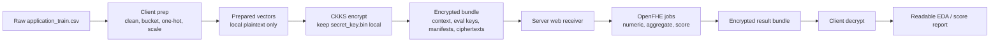

# Overall Home Credit HE Flow



```mermaid
flowchart LR
  raw["Raw application_train.csv"]
  prep["Client prep\nclean, bucket, one-hot, scale"]
  plain["Prepared vectors\nlocal plaintext only"]
  enc["CKKS encrypt\nkeep secret_key.bin local"]
  upload["Encrypted bundle\ncontext, eval keys, manifests, ciphertexts"]
  web["Server web receiver"]
  jobs["OpenFHE jobs\nnumeric, aggregate, score"]
  returns["Encrypted result bundle"]
  dec["Client decrypt"]
  report["Readable EDA / score report"]

  raw --> prep --> plain --> enc --> upload --> web --> jobs --> returns --> dec --> report
```

Purpose:

```text
Run Home Credit EDA and simple scoring on encrypted client data without sending
raw applicant rows to the server.
```
