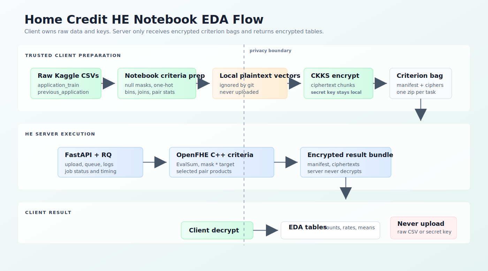
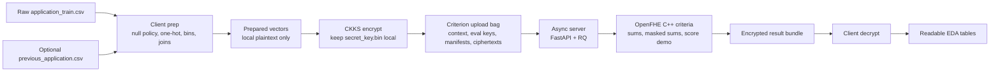

# Overall Home Credit HE Flow





Purpose:

```text
Run Home Credit notebook EDA criteria on encrypted client data without sending
raw applicant rows, plaintext prepared vectors, or secret keys to the server.
```
