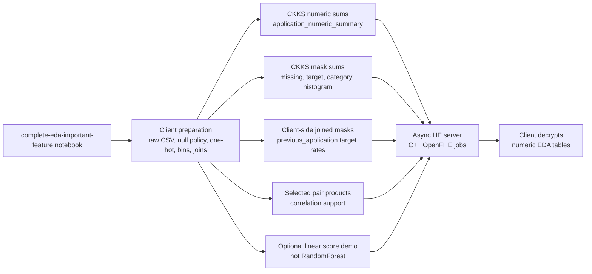

# Notebook EDA Criteria Map




Criteria exposed by the web UI:

```text
missing_data
target_balance
application_numeric_summary
application_category_counts
application_default_rates
application_numeric_histograms
previous_application_category_counts
previous_application_target_rates
selected_correlation_stats
linear_score_demo
```
