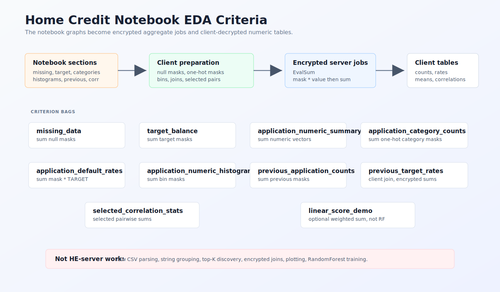
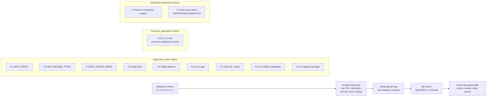

# Notebook EDA Criteria Map





Implemented web jobs:

```text
39 visible jobs:
1 missing-data job
3 numeric distribution jobs
9 application category-count jobs
1 target-balance job
7 target-conditioned category jobs
16 previous_application category jobs
1 correlation-support job
1 linear-score demo
```
