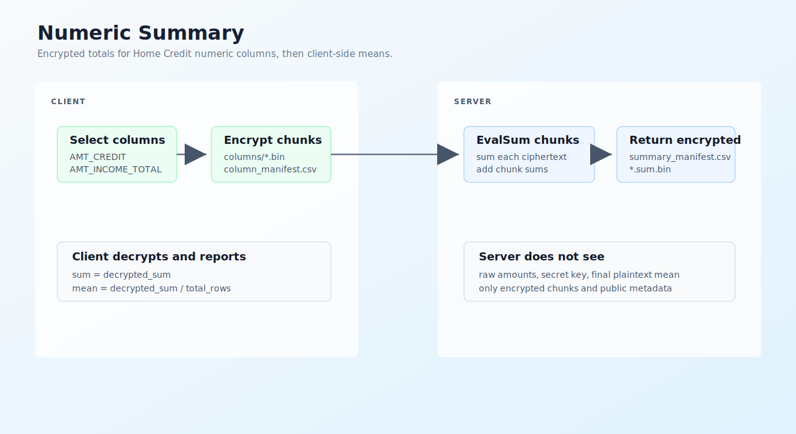
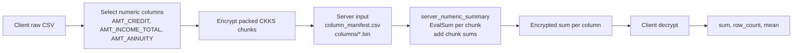

# Numeric Summary




```mermaid
flowchart LR
  csv["Client raw CSV"]
  select["Select numeric columns\nAMT_CREDIT, AMT_INCOME_TOTAL, AMT_ANNUITY"]
  encrypt["Encrypt packed CKKS chunks"]
  bundle["Server input\ncolumn_manifest.csv\ncolumns/*.bin"]
  server["server_numeric_summary\nEvalSum per chunk\nadd chunk sums"]
  out["Encrypted sum per column"]
  decrypt["Client decrypt"]
  report["sum, row_count, mean"]

  csv --> select --> encrypt --> bundle --> server --> out --> decrypt --> report
```

Server operation:

```text
encrypted_sum(column) = EvalSum(chunk_0) + EvalSum(chunk_1) + ...
```
