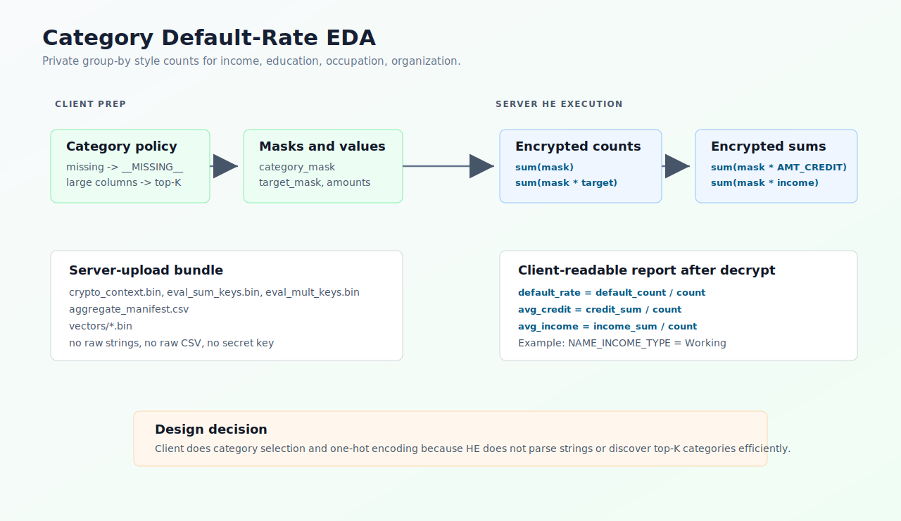

# Category Default-Rate EDA




```mermaid
flowchart LR
  csv["Client raw CSV"]
  policy["Category policy\nmissing bucket\ntop-K + OTHER"]
  masks["One-hot category masks\nTARGET mask\namount vectors"]
  enc["Encrypt masks and values"]
  bundle["Server input\naggregate_manifest.csv\nvectors/*.bin"]
  server["server_home_credit_aggregate\nanalysis-filter category"]
  results["Encrypted count\ndefault_count\namount_sum"]
  client["Client decrypt"]
  report["default_rate\navg_credit\navg_income"]

  csv --> policy --> masks --> enc --> bundle --> server --> results --> client --> report
```

Server operations:

```text
count = sum(category_mask)
default_count = sum(category_mask * target_mask)
amount_sum = sum(category_mask * amount)
```
