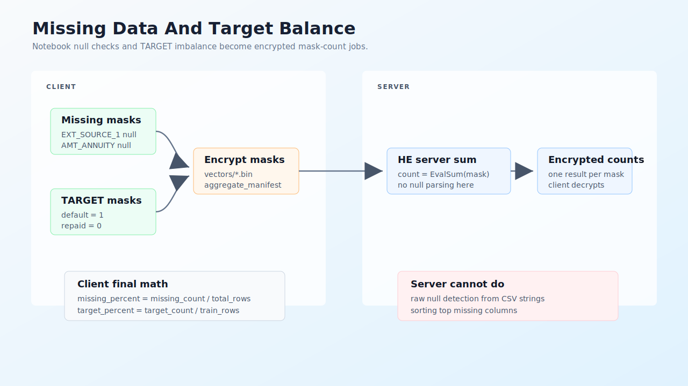
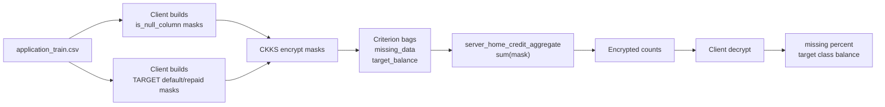

# Missing Data And Target Balance




```mermaid
flowchart LR
  raw["application_train.csv"]
  nulls["Client builds\nis_null_column masks"]
  target["Client builds\nTARGET default/repaid masks"]
  enc["CKKS encrypt masks"]
  bag["Criterion bags\nmissing_data\ntarget_balance"]
  server["server_home_credit_aggregate\nsum(mask)"]
  encrypted["Encrypted counts"]
  client["Client decrypt"]
  report["missing percent\ntarget class balance"]

  raw --> nulls --> enc
  raw --> target --> enc
  enc --> bag --> server --> encrypted --> client --> report
```

HE operation:

```text
missing_count(column) = sum(is_null_column_mask)
default_count = sum(target_default_mask)
repaid_count = sum(target_repaid_mask)
```
