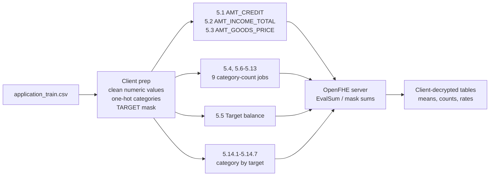

# Application EDA Criteria




Representative HE operations:

```text
numeric_sum = EvalSum(numeric_vector)
count = sum(category_mask)
target_default_count = sum(target_default_mask)
default_count_by_category = sum(category_mask * TARGET)
```
