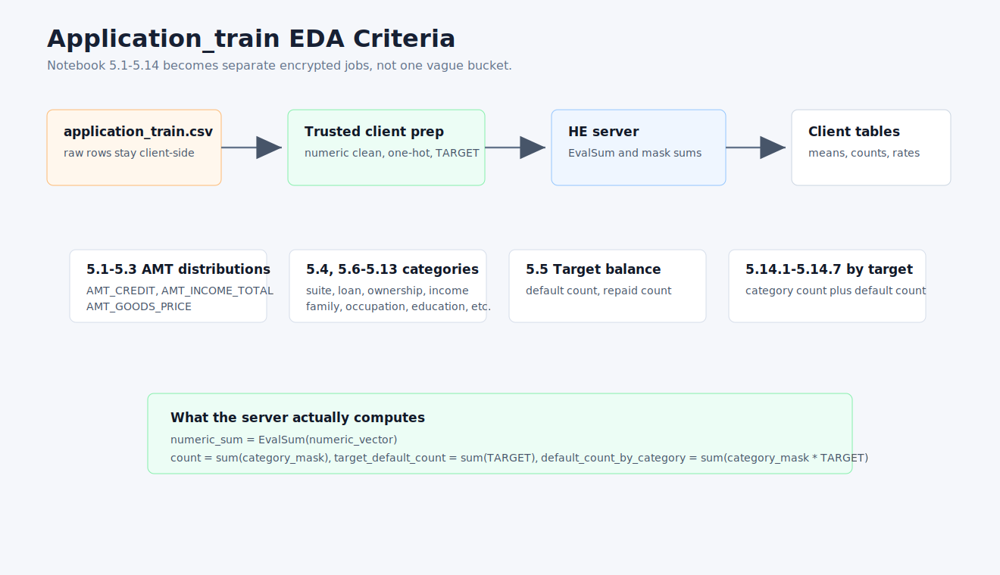
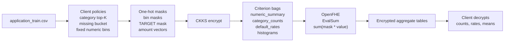

# Application EDA Criteria




```mermaid
flowchart LR
  raw["application_train.csv"]
  policy["Client policies\ncategory top-K\nmissing bucket\nfixed numeric bins"]
  masks["One-hot masks\nbin masks\nTARGET mask\namount vectors"]
  enc["CKKS encrypt"]
  bags["Criterion bags\nnumeric_summary\ncategory_counts\ndefault_rates\nhistograms"]
  server["OpenFHE\nEvalSum\nsum(mask * value)"]
  encrypted["Encrypted aggregate tables"]
  report["Client decrypts\ncounts, rates, means"]

  raw --> policy --> masks --> enc --> bags --> server --> encrypted --> report
```

HE operations:

```text
count = sum(mask)
default_count = sum(mask * TARGET)
amount_sum = sum(mask * amount)
numeric_sum = sum(numeric_vector)
```
