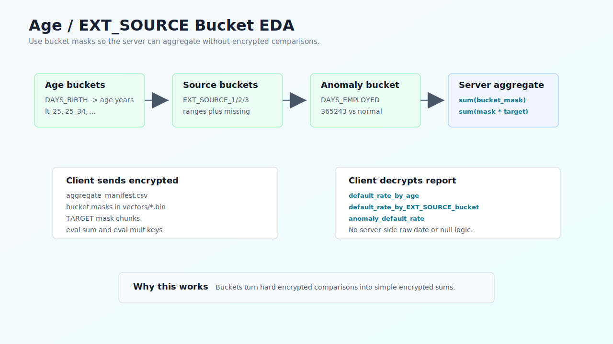
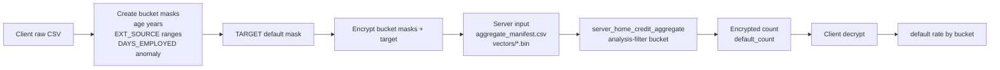

# Age / EXT_SOURCE Bucket EDA




```mermaid
flowchart LR
  csv["Client raw CSV"]
  buckets["Create bucket masks\nage years\nEXT_SOURCE ranges\nDAYS_EMPLOYED anomaly"]
  target["TARGET default mask"]
  enc["Encrypt bucket masks + target"]
  bundle["Server input\naggregate_manifest.csv\nvectors/*.bin"]
  server["server_home_credit_aggregate\nanalysis-filter bucket"]
  results["Encrypted count\ndefault_count"]
  client["Client decrypt"]
  report["default rate by bucket"]

  csv --> buckets --> target --> enc --> bundle --> server --> results --> client --> report
```

Server operations:

```text
count = sum(bucket_mask)
default_count = sum(bucket_mask * target_mask)
```
