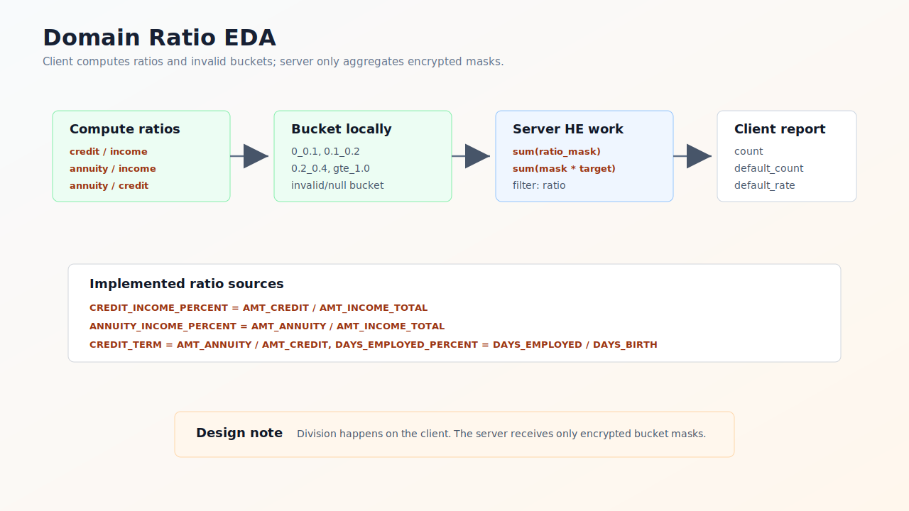
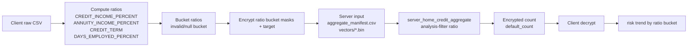

# Domain Ratio EDA




```mermaid
flowchart LR
  csv["Client raw CSV"]
  ratios["Compute ratios\nCREDIT_INCOME_PERCENT\nANNUITY_INCOME_PERCENT\nCREDIT_TERM\nDAYS_EMPLOYED_PERCENT"]
  buckets["Bucket ratios\ninvalid/null bucket"]
  enc["Encrypt ratio bucket masks + target"]
  bundle["Server input\naggregate_manifest.csv\nvectors/*.bin"]
  server["server_home_credit_aggregate\nanalysis-filter ratio"]
  results["Encrypted count\ndefault_count"]
  client["Client decrypt"]
  report["risk trend by ratio bucket"]

  csv --> ratios --> buckets --> enc --> bundle --> server --> results --> client --> report
```

Server operations:

```text
count = sum(ratio_bucket_mask)
default_count = sum(ratio_bucket_mask * target_mask)
```
