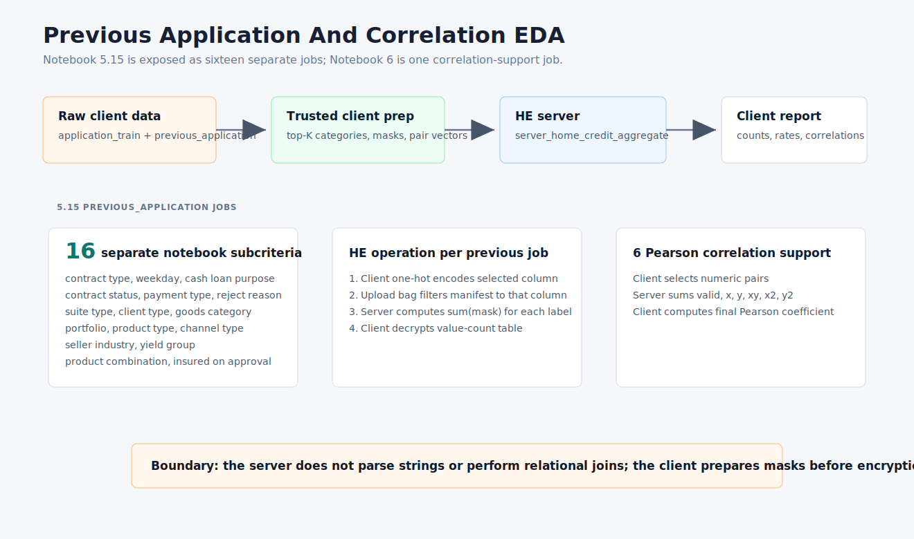
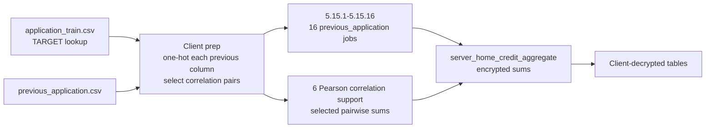

# Previous Application And Correlation EDA





Previous-application jobs:

```text
prev_contract_type
prev_weekday_process_start
prev_cash_loan_purpose
prev_contract_status
prev_payment_type
prev_reject_reason
prev_suite_type
prev_client_type
prev_goods_category
prev_portfolio
prev_product_type
prev_channel_type
prev_seller_industry
prev_yield_group
prev_product_combination
prev_insured_on_approval
```

Important boundary:

```text
The server does not do encrypted relational joins. The client joins and masks
before encryption when target-conditioned previous EDA is needed.
```
