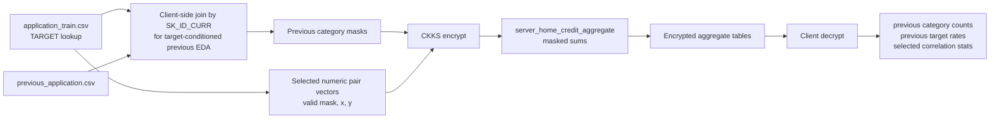

# Previous Application And Correlation EDA




Important boundary:

```text
The server does not do encrypted relational joins. The client joins and masks
before encryption, then the server only computes encrypted sums.
```
