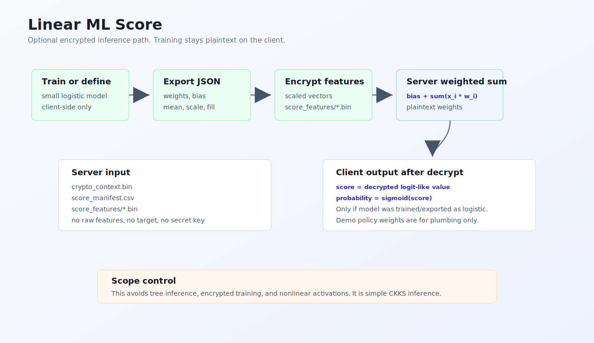

# Linear ML Score




```mermaid
flowchart LR
  train["Client optional training\nsklearn logistic regression"]
  model["Export model JSON\nweights, bias, scaler"]
  prep["Prepare scaled feature vectors"]
  enc["Encrypt feature vectors"]
  bundle["Server input\nscore_manifest.csv\nscore_features/*.bin"]
  server["server_linear_score\nCKKS weighted sum"]
  score["Encrypted score chunks"]
  dec["Client decrypt"]
  report["score\noptional sigmoid probability"]

  train --> model --> prep --> enc --> bundle --> server --> score --> dec --> report
```

Server operation:

```text
score = bias + sum(feature_i * plaintext_weight_i)
```

This is encrypted inference only. Training remains plaintext on the client.
