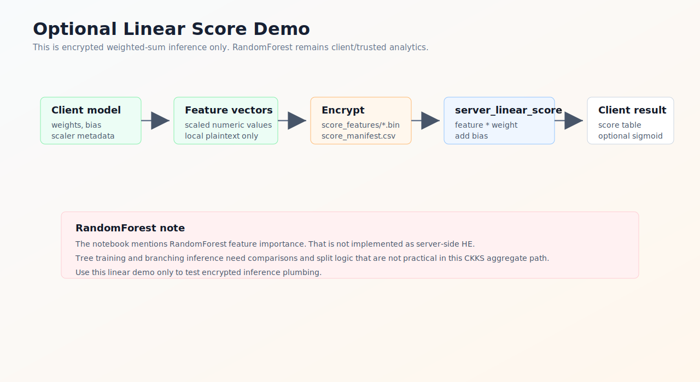

# 7 Linear Score Demo




```mermaid
flowchart LR
  train["Client/trusted training\noptional linear model"]
  prep["Scale selected numeric features"]
  enc["Encrypt feature vectors"]
  bag["Notebook 7 replacement\nlinear_score_demo bag"]
  server["server_linear_score\nweighted CKKS sum"]
  encrypted["Encrypted score chunks"]
  client["Client decrypt"]
  report["score table\noptional sigmoid"]

  train --> prep --> enc --> bag --> server --> encrypted --> client --> report
```

This is not RandomForest:

```text
RandomForest training, branching inference, and feature importance are not
server-side HE work in this prototype.
```
