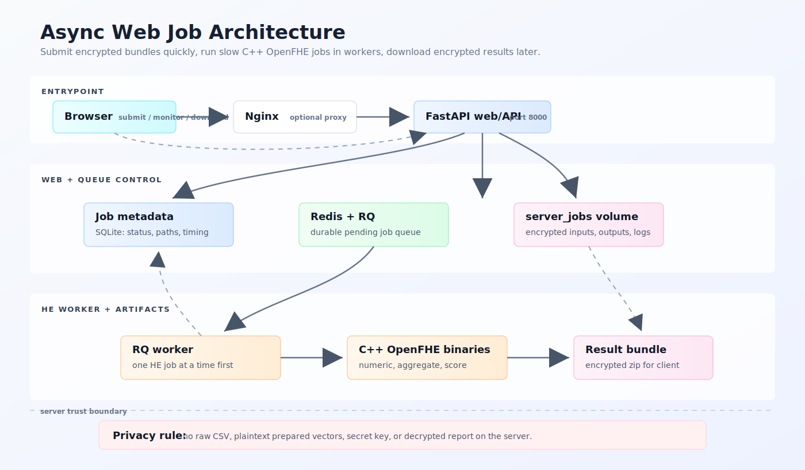
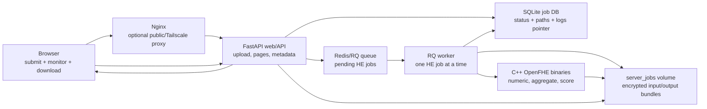

# Async Web Job Architecture





Purpose:

```text
Make slow HE jobs asynchronous: submit now, monitor status/logs, download the
encrypted result bundle later.
```

Trust boundary:

```text
Server stores encrypted artifacts, public/eval keys, job metadata, and logs.
Server still must not receive raw CSV, plaintext prepared vectors, secret key,
or decrypted reports.
```
