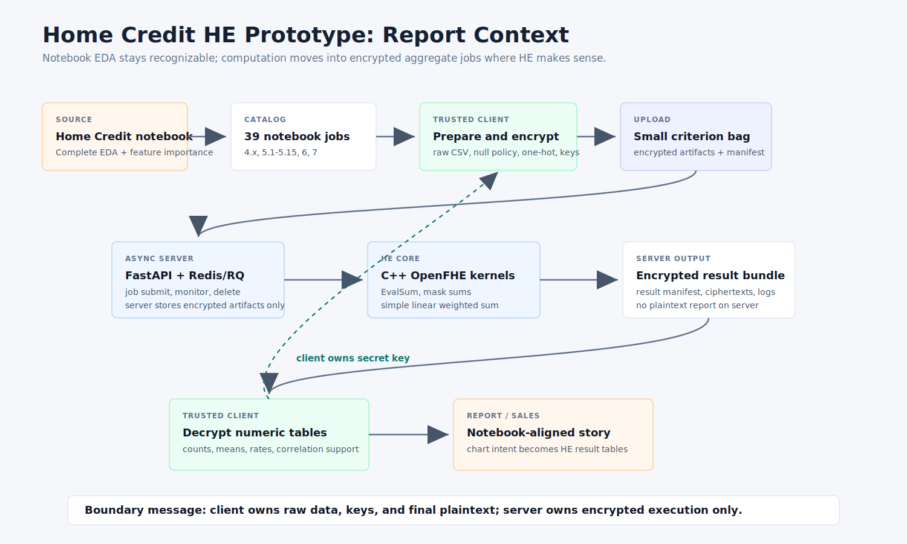

# Report Slide Project Context

```mermaid
flowchart LR
  notebook["Home Credit notebook\ncomplete EDA + feature importance"]
  criteria["39 notebook-facing jobs\n4.x, 5.1-5.15, 6, 7"]
  client["Trusted client\nraw CSV, null policy,\none-hot, scaling, secret key"]
  encrypt["OpenFHE CKKS encryption\nsmall upload bag per criterion"]
  web["Async HE web server\nFastAPI, Redis/RQ, job monitor"]
  cpp["C++ OpenFHE kernels\nEvalSum, mask sums,\nlinear weighted sum"]
  encrypted["Encrypted result bundle\nserver never decrypts"]
  decrypt["Trusted client decrypts\nnumeric EDA tables"]
  slides["Report / sales slides\ncounts, means, rates,\ncorrelation support, demo score"]

  notebook --> criteria --> client --> encrypt --> web --> cpp --> encrypted --> decrypt --> slides

  client -. owns .-> decrypt
  web -. no raw data .-> cpp
```





Slide message:

```text
We preserve the notebook story, but each chart becomes an encrypted aggregate
job. The client owns raw data and keys. The server only runs OpenFHE C++
operations and returns encrypted results.
```
