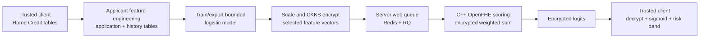

# Unified Home Credit Credit Scoring

```mermaid
flowchart LR
    A["Trusted client<br/>Home Credit tables"] --> B["Applicant feature engineering<br/>application + history tables"]
    B --> C["Train/export bounded<br/>logistic model"]
    C --> D["Scale and CKKS encrypt<br/>selected feature vectors"]
    D --> E["Server web queue<br/>Redis + RQ"]
    E --> F["C++ OpenFHE scoring<br/>encrypted weighted sum"]
    F --> G["Encrypted logits"]
    G --> H["Trusted client<br/>decrypt + sigmoid + risk band"]
```

Raw rows, identifiers, secret keys, and decrypted risk results remain on the
trusted client. The HE server sees model metadata and ciphertext vectors only.
